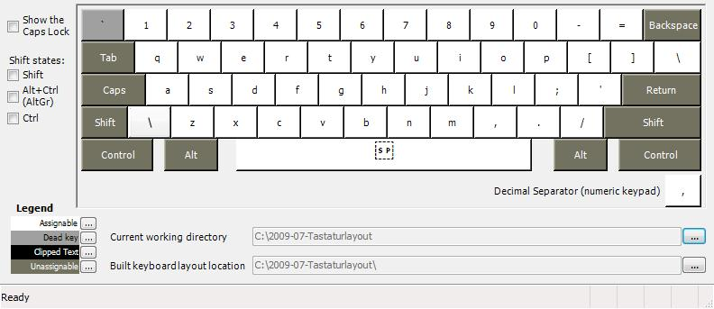
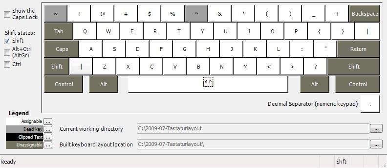
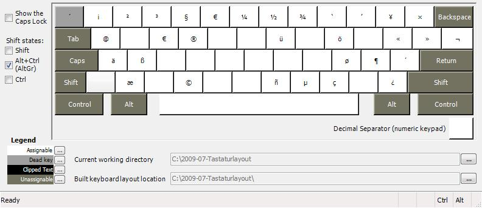
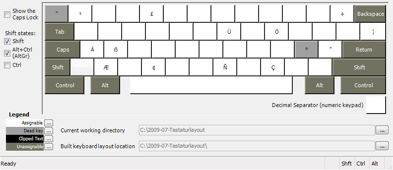

# Tastaturlayout-Denglisch - Deutsche Umlaute auf einer QUERTY-Tastatur unter Windows

Für Benutzer von amerikanischen Tastaturen, die auch deutsche Umlaute und mehr verwenden möchten.

Ich habe mir als Programmierer und Systemadministrator die Benutzung einer Amerikanischen-, bzw. Englischen-QUERTY-Tastatur angewöhnt. Die Zeichen /, \, ;, <, >, =, [, ], {, } sind auf dieser wesentlich leichter zu erreichen, ohne ständig Alt-Gr drücken zu müssen. Die deutschen Umlaute aber fehlen dann.

Unter Linux habe ich mir einfach eine .Xmodmap erzeugt, sodass ich mit Alt-Gr + a = ä, Alt-Gr + A = Ä, usw. und Alt-Gr + s = ß die deutschen Umlaute und das scharfe S, welches übrigens nicht abgeschafft wurde, wieder auf die Tastatur gebracht habe. Ich finde es bequemer bei Texten das Alt-Gr für die Umlaute zu verwenden als bei Programmierarbeiten ständig Alt-Gr für die Sonderzeichen.

Irgendwann stieß ich 2009 auf den Microsoft [Keyboard Layout Creator (MKLC)](https://www.microsoft.com/en-us/download/details.aspx?id=102134). Dort kann man sich ein vorhandenes Layout laden und dieses sehr komfortabel abändern, lief bis ins Jahr 2023 Problemlos, dann Upgrade auf MKLC Version 1.4, damit lassen sich die Layouts auch wieder auf Windows 11 22H2 und neuer installieren.

## Mappings

* Alle sichtbaren Zeichen der Amerikanischen-QWERTY-Tastatur werden nicht umgemappt.
* Für ä, ö, ü Alt-Gr + a/o/u
* Für Ä, Ö, Ü Alt-Gr + Shift + a/o/u
* Für ß Alt-Gr + s
* Das neue große scharfe S geht mit Alt-Gr + Shift + s
* Häufig verwendete Zeichen wie ' oder " oder sind keine Deadkeys, welche auf dem Microsoft-Tastaturlayout "Englisch (USA, International)", der einzigen brauchbaren mitgelieferten Alternative, beim schreiben sonst ziemlich nerven können.
* Alt-Gr + e, bzw. Alt-Gr + Shift + 5 = €
* Alt-Gr + , = ¢
* Alt-Gr + 4 = §
* Alt-Gr + q = @ (Zusätzlich zu Shift + 2)
* Alt-Gr + m = µ
* Alt-Gr + r = ®
* Alt-Gr + c = ©
* Alt-Gr + { = «
* Alt-Gr + } = »
* Alt-Gr + ? = ¿
* Alt-Gr + ! = ¡
* `, dann a, e, i, o, u = à, è, usw.
* `, dann A, E, I, O, U = À, È, usw.
* ~ (Shift + `), dann n, a, o = ñ, ã, õ
* ~ (Shift + `), dann N, A, O = ñ, ã, Õ
* Alt-Gr + ` = ´
* Alt-Gr + `, dann a, e, i, ,o, y = á, é, usw.
* Alt-Gr + `, dann a, e, i, , = Á, É, usw.
* Alt-Gr + Shift + `, dann a, e, i, o, u, y = ä, ë;, usw. (Für noch mehr Umlaute als die Deutschen)
* Alt-Gr + Shift + `, dann a, e, i, o, u = ä, ë;, usw.
* ^ (Shift + 6), dann a, e, i, o, u = â, ê, usw.
* ^ (Shift + 6), dann A, E, I, U, U = Â, Ê, usw.
* Alt-Gr + Shift + ; = °
* Alt-Gr + Shift + ;, dann a = å
* Alt-Gr + Shift + ;, dann A = Å
* Alt-Gr + x = æ
* Alt-Gr + Shift + x = Æ
* Alt-Gr + c = ç
* Alt-Gr + Shift + c = Ç

## Screenshots

## Building

Use Microsoft Keyboard Layout Creator (MSKLC) Version 1.4 from <https://www.microsoft.com/en-us/download/details.aspx?id=102134>

## Download

See <https://github.com/fashberg/denglisch/releases>
